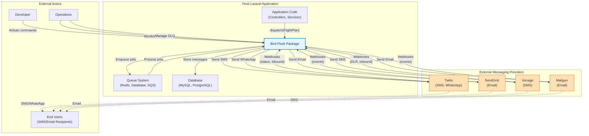
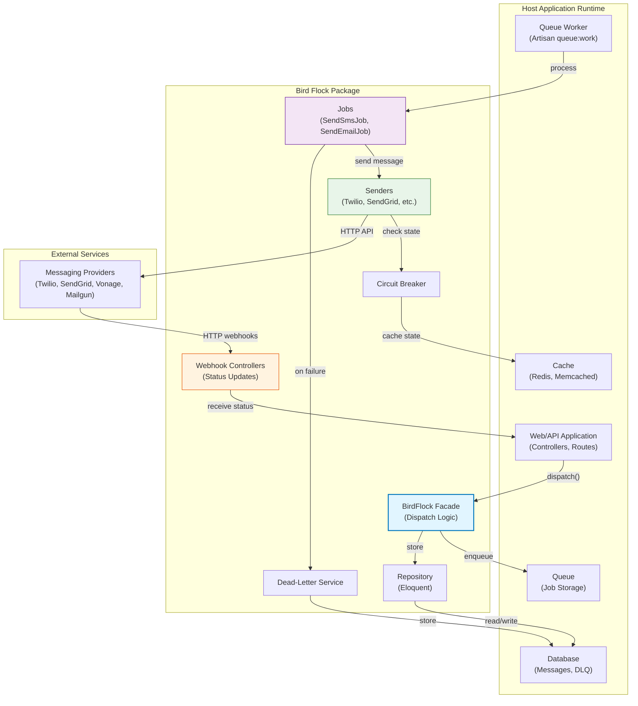
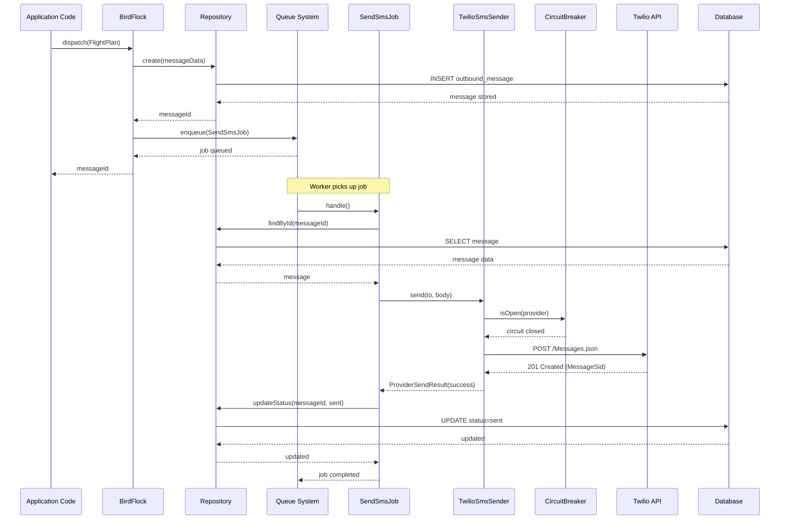
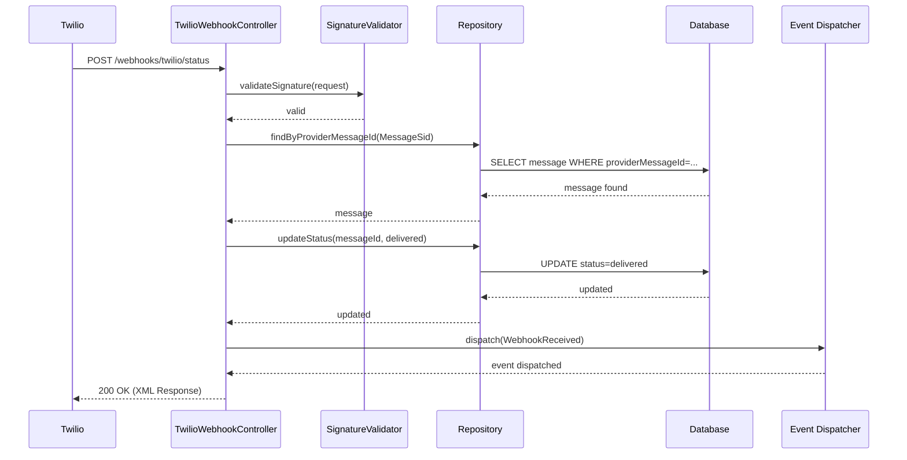

# Architecture Diagrams

This document provides high-level architecture diagrams for the **Bird Flock** package using Mermaid.

---

## System Context Diagram

Shows Bird Flock in the context of external actors and systems.

**Key Interactions**:

- **Application Code** dispatches messages via `BirdFlock::dispatch()`
- **Bird Flock** stores messages in DB, enqueues jobs, and sends via providers
- **Providers** send messages to end users and return webhooks to Bird Flock
- **Developers & Ops** use Artisan commands and health endpoints

---

## Container Diagram

High-level containers within the Bird Flock package and host application.

**Container Roles**:

- **BirdFlock Facade**: Entry point for message dispatch
- **Queue**: Stores jobs for async processing
- **Worker**: Processes jobs from queue
- **Jobs**: Channel-specific send jobs (SMS, WhatsApp, Email)
- **Senders**: Provider-specific API integrations
- **Circuit Breaker**: Tracks provider health, fails fast on outages
- **Repository**: Eloquent-based persistence layer
- **Webhooks**: HTTP endpoints for provider callbacks
- **DLQ**: Captures failed messages for later replay

---

## Component Diagram

Laravel-level components and their interactions.

```mermaid
flowchart TB
    subgraph "Application Layer"
        AppCtrl["Application Controllers<br/>(Your Code)"]
        AppSvc["Application Services<br/>(Your Code)"]
    end

    subgraph "Bird Flock Package"
        subgraph "Entry Point"
            BirdFlockFacade["BirdFlock<br/>(Static Dispatch)"]
        end

        subgraph "DTOs"
            FlightPlan["FlightPlan<br/>(Message Payload)"]
            ProviderResult["ProviderSendResult<br/>(Send Result)"]
        end

        subgraph "Jobs"
            DispatchJob["DispatchMessageJob<br/>(Route to Channel)"]
            SendSmsJob["SendSmsJob"]
            SendWhatsappJob["SendWhatsappJob"]
            SendEmailJob["SendEmailJob"]
        end

        subgraph "Senders (Provider Abstraction)"
            TwilioSms["TwilioSmsSender"]
            TwilioWhatsapp["TwilioWhatsappSender"]
            SendgridEmail["SendgridEmailSender"]
            MailgunEmail["MailgunEmailSender"]
            VonageSms["VonageSmsSender"]
        end

        subgraph "Support Services"
            CircuitBreaker["CircuitBreaker"]
            BackoffStrategy["BackoffStrategy"]
            DeadLetterSvc["DeadLetterService"]
            Logger["Logger"]
            Masking["Masking"]
            MetricsCollector["MetricsCollector"]
        end

        subgraph "Data Layer"
            Repo["OutboundMessageRepository<br/>(Interface)"]
            EloquentRepo["EloquentOutboundMessageRepository"]
            OutboundModel["OutboundMessage<br/>(Eloquent Model)"]
            DLQModel["DeadLetterEntry<br/>(Eloquent Model)"]
        end

        subgraph "HTTP Layer"
            HealthCtrl["HealthCheckController"]
            TwilioWebhook["TwilioWebhookController"]
            SendgridWebhook["SendgridWebhookController"]
            VonageWebhook["VonageWebhookController"]
            MailgunWebhook["MailgunWebhookController"]
        end

        subgraph "Events"
            MessageQueued["MessageQueued"]
            MessageSending["MessageSending"]
            MessageFinalized["MessageFinalized"]
            MessageDeadLettered["MessageDeadLettered"]
            WebhookReceived["WebhookReceived"]
        end

        subgraph "Console Commands"
            ConfigValidateCmd["ConfigValidateCommand"]
            DeadLetterCmd["DeadLetterCommand"]
            TestSmsCmd["SendTestSmsCommand"]
            TestWhatsappCmd["SendTestWhatsappCommand"]
            TestEmailCmd["SendTestEmailCommand"]
        end
    end

    subgraph "Laravel Framework"
        QueueSys["Queue System"]
        EventDispatcher["Event Dispatcher"]
        CacheSys["Cache"]
        DBLayer["Database"]
    end

    subgraph "External APIs"
        TwilioAPI["Twilio API"]
        SendGridAPI["SendGrid API"]
        VonageAPI["Vonage API"]
        MailgunAPI["Mailgun API"]
    end

    %% Application Layer
    AppCtrl --> AppSvc
    AppSvc --> BirdFlockFacade

    %% Dispatch Flow
    BirdFlockFacade --> FlightPlan
    BirdFlockFacade --> Repo
    BirdFlockFacade --> Logger
    BirdFlockFacade --> MetricsCollector
    BirdFlockFacade --> QueueSys
    QueueSys --> DispatchJob
    DispatchJob --> SendSmsJob
    DispatchJob --> SendWhatsappJob
    DispatchJob --> SendEmailJob

    %% Job to Sender
    SendSmsJob --> TwilioSms
    SendSmsJob --> VonageSms
    SendWhatsappJob --> TwilioWhatsapp
    SendEmailJob --> SendgridEmail
    SendEmailJob --> MailgunEmail

    %% Senders to Support
    TwilioSms --> CircuitBreaker
    TwilioSms --> BackoffStrategy
    TwilioSms --> ProviderResult
    TwilioSms --> TwilioAPI
    SendgridEmail --> CircuitBreaker
    SendgridEmail --> SendGridAPI
    VonageSms --> CircuitBreaker
    VonageSms --> VonageAPI

    %% Circuit Breaker
    CircuitBreaker --> CacheSys

    %% Jobs to DLQ
    SendSmsJob --> DeadLetterSvc
    SendWhatsappJob --> DeadLetterSvc
    SendEmailJob --> DeadLetterSvc
    DeadLetterSvc --> DLQModel

    %% Repository
    Repo --> EloquentRepo
    EloquentRepo --> OutboundModel
    EloquentRepo --> DBLayer

    %% Events
    BirdFlockFacade --> MessageQueued
    SendSmsJob --> MessageSending
    SendSmsJob --> MessageFinalized
    SendSmsJob --> MessageDeadLettered
    TwilioWebhook --> WebhookReceived

    %% HTTP Layer
    HealthCtrl --> CircuitBreaker
    TwilioWebhook --> EventDispatcher
    SendgridWebhook --> EventDispatcher

    %% Console Commands
    ConfigValidateCmd --> Logger
    DeadLetterCmd --> DeadLetterSvc
    TestSmsCmd --> BirdFlockFacade

    style BirdFlockFacade fill:#e1f5ff,stroke:#0277bd,stroke-width:2px
    style FlightPlan fill:#fff9c4,stroke:#f57f17
    style SendSmsJob fill:#f3e5f5,stroke:#6a1b9a
    style TwilioSms fill:#e8f5e9,stroke:#2e7d32
    style CircuitBreaker fill:#ffe0b2,stroke:#e65100
```

**Component Responsibilities**:

- **BirdFlock**: Orchestrates dispatch, idempotency, and job queueing
- **FlightPlan**: DTO carrying message payload
- **Jobs**: Channel-specific send logic with retry handling
- **Senders**: Provider API integrations with circuit breaker checks
- **CircuitBreaker**: Tracks provider failures, opens/closes circuits
- **BackoffStrategy**: Calculates exponential backoff delays
- **DeadLetterService**: Captures permanently failed messages
- **Repository**: Abstracts database access for messages
- **Webhooks**: Handle provider callbacks and update message status
- **Events**: Decouple components and provide extension points
- **Commands**: CLI tools for testing and ops

---

## Message Dispatch Flow (Sequence)

Detailed sequence of a successful SMS send.

---

## Webhook Processing Flow (Sequence)

Sequence for receiving Twilio delivery status webhook.

---

## Assumptions

- **Diagrams Simplified**: Real implementation includes additional error handling, metrics collection, and logging.
- **Database Schema**: Diagrams assume `outbound_messages` and `dead_letters` tables exist (see migrations).
- **Queue Driver Agnostic**: Diagrams show generic "Queue System"; actual driver (Redis, Database, SQS) is transparent to Bird Flock.
- **Mermaid Rendering**: Diagrams require Mermaid-compatible Markdown viewer (GitHub, GitLab, VS Code with extensions).

For unresolved architecture questions, see [Open Questions & Assumptions](open-questions-and-assumptions.md).
