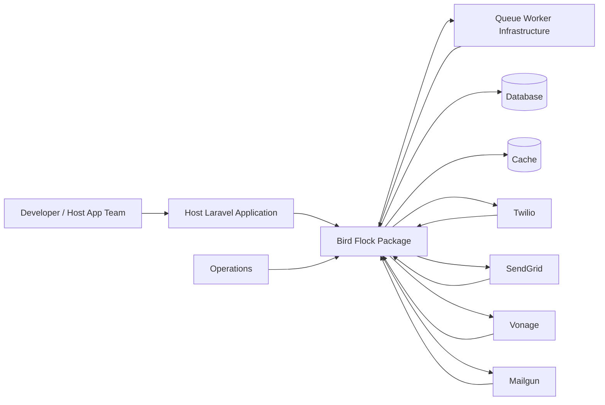
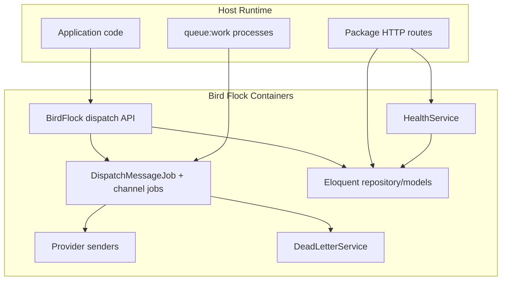
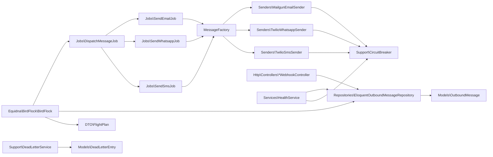

# Architecture Diagrams

## System Context Diagram

```mermaid
flowchart LR
  Dev[Developer / Host App Team]
  Ops[Operations]
  Host[Host Laravel Application]
  BF[Bird Flock Package]
  Queue[Queue Worker Infrastructure]
  DB[(Database)]
  Cache[(Cache)]
  Twilio[Twilio]
  SendGrid[SendGrid]
  Vonage[Vonage]
  Mailgun[Mailgun]

  Dev --> Host
  Host --> BF
  BF --> Queue
  Queue --> BF
  BF --> DB
  BF --> Cache
  BF --> Twilio
  BF --> SendGrid
  BF --> Vonage
  BF --> Mailgun
  Twilio --> BF
  SendGrid --> BF
  Vonage --> BF
  Mailgun --> BF
  Ops --> BF
```

## Container Diagram

```mermaid
flowchart TB
  subgraph Host Runtime
    App[Application code]
    Worker[queue:work processes]
    Routes[Package HTTP routes]
  end

  subgraph Bird Flock Containers
    Bus[BirdFlock dispatch API]
    Jobs[DispatchMessageJob + channel jobs]
    Senders[Provider senders]
    Repo[Eloquent repository/models]
    DLQ[DeadLetterService]
    Health[HealthService]
  end

  App --> Bus
  Bus --> Repo
  Bus --> Jobs
  Worker --> Jobs
  Jobs --> Senders
  Jobs --> DLQ
  Routes --> Repo
  Routes --> Health
  Health --> Repo
```

## Component Diagram

```mermaid
flowchart LR
  BF[Equidna\BirdFlock\BirdFlock]
  FP[DTO\FlightPlan]
  DMJ[Jobs\DispatchMessageJob]
  SJ[Jobs\SendSmsJob]
  WJ[Jobs\SendWhatsappJob]
  EJ[Jobs\SendEmailJob]
  MF[MessageFactory]
  TS[Senders\TwilioSmsSender]
  TW[Senders\TwilioWhatsappSender]
  MG[Senders\MailgunEmailSender]
  REPO[Repositories\EloquentOutboundMessageRepository]
  OMM[Models\OutboundMessage]
  DLS[Support\DeadLetterService]
  DLM[Models\DeadLetterEntry]
  CB[Support\CircuitBreaker]
  HC[Http\Controllers\*WebhookController]
  HS[Services\HealthService]

  BF --> FP
  BF --> REPO
  BF --> DMJ
  DMJ --> SJ
  DMJ --> WJ
  DMJ --> EJ
  SJ --> MF
  WJ --> MF
  EJ --> MF
  MF --> TS
  MF --> TW
  MF --> MG
  TS --> CB
  TW --> CB
  MG --> CB
  REPO --> OMM
  DLS --> DLM
  HC --> REPO
  HS --> CB
  HS --> REPO
```

Notes:

- Email channel currently resolves through `MessageFactory::createMailgunEmailSender()`.
- `SendgridEmailSender` and `VonageSmsSender` exist in codebase but are not selected by current factory routing.
