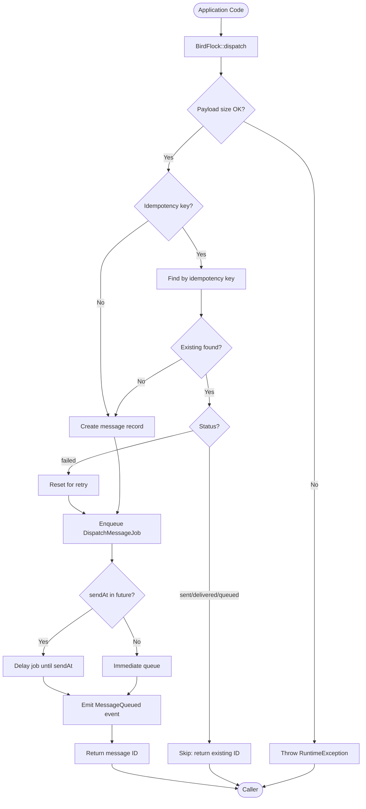
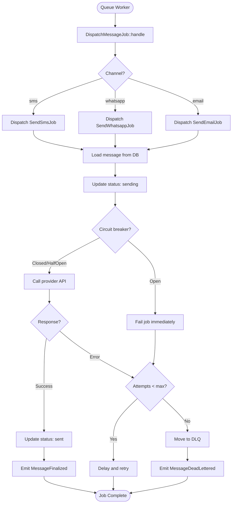
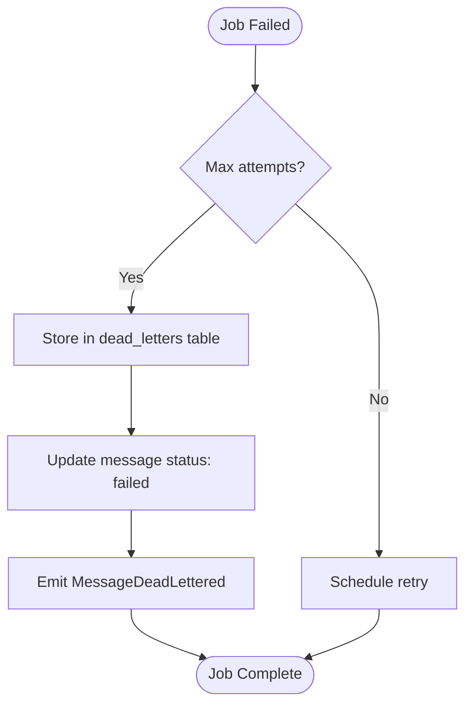
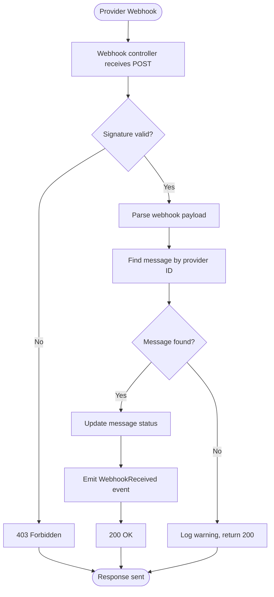

# Business Logic & Core Processes

This document describes the main business processes and domain logic in **Bird Flock**.

---

## Overview

**Bird Flock** is a messaging bus for **multi-channel outbound messaging** with:

- **Idempotency**: Prevent duplicate sends via unique keys
- **Reliability**: Automatic retries with exponential backoff
- **Observability**: Structured logging, events, and metrics
- **Fault Tolerance**: Circuit breakers and dead-letter queue
- **Provider Abstraction**: Seamlessly switch or extend providers

---

## Core Concepts

### 1. FlightPlan (Message Payload)

**Class**: `Equidna\BirdFlock\DTO\FlightPlan` (`src/DTO/FlightPlan.php`)

**Purpose**: Data transfer object representing a message to send.

**Key Properties**:

| Property         | Type                       | Description                            |
| ---------------- | -------------------------- | -------------------------------------- |
| `channel`        | `string`                   | `sms`, `whatsapp`, or `email`          |
| `to`             | `string`                   | Recipient (phone or email)             |
| `from`           | `string` (optional)        | Sender (overrides config default)      |
| `body`           | `string` (optional)        | Message body (SMS, WhatsApp)           |
| `subject`        | `string` (optional)        | Email subject                          |
| `html`           | `string` (optional)        | Email HTML body                        |
| `templateKey`    | `string` (optional)        | Provider template ID                   |
| `templateData`   | `array` (optional)         | Template variables                     |
| `idempotencyKey` | `string` (optional)        | Unique key for deduplication           |
| `sendAt`         | `\DateTimeInterface` (opt) | Scheduled send time (future timestamp) |
| `metadata`       | `array` (optional)         | Custom data (not sent to provider)     |

**Example**:

```php
use Equidna\BirdFlock\DTO\FlightPlan;

$plan = new FlightPlan(
    channel: 'email',
    to: 'user@example.com',
    subject: 'Welcome to Bird Flock!',
    body: 'Thank you for signing up.',
    idempotencyKey: 'user:123:welcome-email'
);
```

---

### 2. Idempotency Keys

**Purpose**: Prevent duplicate message sends when the same request is made multiple times.

**Format**: Compound key combining:

- Tenant/Account ID (if multi-tenant)
- Domain entity (e.g., `order`, `user`)
- Entity ID
- Purpose (e.g., `shipping-sms`, `welcome-email`)

**Example**:

```
tenant:42:order:1234:shipping-sms
user:567:password-reset-email
```

**Behavior**:

1. On dispatch, check if a message with the same `idempotencyKey` already exists
2. If found and status is `sent`, `delivered`, `queued`, or `sending` → skip dispatch, return existing message ID
3. If found and status is `failed` → reset for retry
4. If not found → create new message and dispatch

**Database Constraint**:

- Unique index on `outbound_messages.idempotency_key`
- Race-safe: concurrent dispatches with same key result in one message (conflict detected and resolved)

---

### 3. Message Lifecycle

**States**: `queued` → `sending` → `sent` → `delivered` (or `failed`)

```mermaid
stateDiagram-v2
    [*] --> queued: BirdFlock::dispatch()
    queued --> sending: Job picked up
    sending --> sent: Provider API success
    sending --> failed: Provider API error
    sent --> delivered: Webhook received
    sent --> failed: Webhook reports failure
    failed --> queued: Retry (if attempts < max)
    failed --> dead_lettered: Max attempts exceeded
    delivered --> [*]
    dead_lettered --> [*]
```

**State Descriptions**:

- **queued**: Message created, job enqueued, awaiting worker pickup
- **sending**: Job processing, API call in progress
- **sent**: Provider accepted message (returned message ID)
- **delivered**: Provider confirmed delivery (via webhook)
- **failed**: Permanent failure after max retry attempts
- **dead_lettered**: Moved to dead-letter queue for manual intervention

---

## Core Processes

### Process 1: Message Dispatch

**Purpose**: Create and enqueue a message for sending.

**Entry Point**: `Equidna\BirdFlock\BirdFlock::dispatch(FlightPlan $payload)`

**Flow**:



**Key Classes**:

- `Equidna\BirdFlock\BirdFlock` (`src/BirdFlock.php`)
- `Equidna\BirdFlock\DTO\FlightPlan` (`src/DTO/FlightPlan.php`)
- `Equidna\BirdFlock\Contracts\OutboundMessageRepositoryInterface` (`src/Contracts/OutboundMessageRepositoryInterface.php`)

**Business Rules**:

1. **Payload Size Limit**: Maximum 256KB (configurable via `BIRD_FLOCK_MAX_PAYLOAD_SIZE`)
2. **Idempotency Window**: No expiration; keys are unique forever
3. **Scheduled Sends**: If `sendAt` is in the future, job is delayed
4. **Race Safety**: Database unique constraint ensures only one message created per idempotency key

**Events Emitted**:

- `MessageQueued` — message dispatched and enqueued
- `MessageDuplicateSkipped` — duplicate idempotency key detected
- `MessageCreateConflict` — concurrent create with same idempotency key (resolved atomically)
- `MessageRetryScheduled` — failed message reset for retry

---

### Process 2: Channel Routing & Sending

**Purpose**: Route message to appropriate channel sender and invoke provider API.

**Entry Point**: `Equidna\BirdFlock\Jobs\DispatchMessageJob`

**Flow**:



**Key Classes**:

- `Equidna\BirdFlock\Jobs\DispatchMessageJob` (`src/Jobs/DispatchMessageJob.php`)
- `Equidna\BirdFlock\Jobs\SendSmsJob` (`src/Jobs/SendSmsJob.php`)
- `Equidna\BirdFlock\Jobs\SendWhatsappJob` (`src/Jobs/SendWhatsappJob.php`)
- `Equidna\BirdFlock\Jobs\SendEmailJob` (`src/Jobs/SendEmailJob.php`)
- `Equidna\BirdFlock\Senders\TwilioSmsSender` (`src/Senders/TwilioSmsSender.php`)
- `Equidna\BirdFlock\Senders\SendgridEmailSender` (`src/Senders/SendgridEmailSender.php`)
- `Equidna\BirdFlock\Support\CircuitBreaker` (`src/Support/CircuitBreaker.php`)

**Business Rules**:

1. **Circuit Breaker**: If provider fails repeatedly (default: 5 consecutive failures), circuit opens for 60 seconds; all requests fail fast
2. **Retry Policy**: Exponential backoff with jitter (base: 1s, max: 60s per channel)
3. **Max Attempts**: Default 3 attempts per channel (configurable via `BIRD_FLOCK_{CHANNEL}_MAX_ATTEMPTS`)
4. **Provider Selection**: SMS can use Twilio or Vonage; Email can use SendGrid or Mailgun (first configured provider is used)

**Events Emitted**:

- `MessageSending` — job started, API call imminent
- `MessageFinalized` — message sent successfully or permanently failed
- `MessageDeadLettered` — message moved to DLQ after max attempts

---

### Process 3: Retry Logic

**Purpose**: Automatically retry failed messages with exponential backoff.

**Strategy**: Exponential backoff with jitter

**Implementation**: `Equidna\BirdFlock\Support\BackoffStrategy` (`src/Support/BackoffStrategy.php`)

**Algorithm**:

```php
delay_ms = min(
    base_delay_ms * (2 ^ attempt_index) + random_jitter(0, 1000),
    max_delay_ms
)
```

**Example Delays** (SMS, base=1000ms, max=60000ms):

| Attempt | Delay (approx) |
| ------- | -------------- |
| 1       | 1–2 seconds    |
| 2       | 2–5 seconds    |
| 3       | 4–9 seconds    |
| Max     | 60 seconds     |

**Business Rules**:

1. **Per-Channel Config**: Each channel (SMS, WhatsApp, Email) has independent retry settings
2. **Jitter**: Random offset prevents thundering herd
3. **Max Delay Cap**: Prevents infinite exponential growth
4. **Job Delay**: Laravel job `delay()` used to schedule retry

**Key Classes**:

- `Equidna\BirdFlock\Support\BackoffStrategy` (`src/Support/BackoffStrategy.php`)
- `Equidna\BirdFlock\Jobs\AbstractSendJob` (`src/Jobs/AbstractSendJob.php`)

---

### Process 4: Dead-Letter Queue (DLQ)

**Purpose**: Capture permanently failed messages for manual intervention.

**Entry Point**: `Equidna\BirdFlock\Support\DeadLetterService::store()`

**Flow**:



**Dead-Letter Entry Fields**:

| Field           | Description                    |
| --------------- | ------------------------------ |
| `id`            | ULID (unique entry ID)         |
| `message_id`    | Original message ID            |
| `channel`       | Channel (sms, whatsapp, email) |
| `payload`       | Original FlightPlan (JSON)     |
| `error_code`    | Provider error code            |
| `error_message` | Error description              |
| `attempts`      | Total attempts made            |
| `created_at`    | When entry was created         |

**Replay Flow**:

```bash
php artisan bird-flock:dead-letter replay <entry_id>
```

1. Load dead-letter entry
2. Re-dispatch message via `BirdFlock::dispatch()`
3. Delete dead-letter entry

**Key Classes**:

- `Equidna\BirdFlock\Support\DeadLetterService` (`src/Support/DeadLetterService.php`)
- `Equidna\BirdFlock\Models\DeadLetterEntry` (`src/Models/DeadLetterEntry.php`)
- `Equidna\BirdFlock\Console\Commands\DeadLetterCommand` (`src/Console/Commands/DeadLetterCommand.php`)

**Business Rules**:

1. **DLQ Enabled by Default**: Disable via `BIRD_FLOCK_DLQ_ENABLED=false`
2. **No Auto-Replay**: Manual replay required
3. **Retention**: No automatic cleanup; purge manually via command

---

### Process 5: Webhook Processing

**Purpose**: Receive and process delivery receipts and status updates from providers.

**Entry Point**: Webhook controllers (e.g., `TwilioWebhookController@status`)

**Flow**:



**Webhook Events Handled**:

| Provider | Events                                                |
| -------- | ----------------------------------------------------- |
| Twilio   | `delivered`, `sent`, `failed`, `undelivered`          |
| SendGrid | `delivered`, `bounce`, `dropped`, `opened`, `clicked` |
| Vonage   | `delivered`, `failed`, `expired`, `rejected`          |
| Mailgun  | `delivered`, `failed`, `opened`, `clicked`            |

**Key Classes**:

- `Equidna\BirdFlock\Http\Controllers\TwilioWebhookController` (`src/Http/Controllers/TwilioWebhookController.php`)
- `Equidna\BirdFlock\Http\Controllers\SendgridWebhookController` (`src/Http/Controllers/SendgridWebhookController.php`)
- `Equidna\BirdFlock\Http\Controllers\VonageWebhookController` (`src/Http/Controllers/VonageWebhookController.php`)
- `Equidna\BirdFlock\Http\Controllers\MailgunWebhookController` (`src/Http/Controllers/MailgunWebhookController.php`)
- `Equidna\BirdFlock\Support\TwilioSignatureValidator` (`src/Support/TwilioSignatureValidator.php`)
- `Equidna\BirdFlock\Support\SendgridSignatureValidator` (`src/Support/SendgridSignatureValidator.php`)

**Business Rules**:

1. **Signature Validation**: All webhooks validate provider signatures (HMAC, public key, or secret-based)
2. **Idempotency**: Webhooks may be retried by providers; status updates are idempotent
3. **Rate Limiting**: 60 requests/min per IP (configurable)
4. **Missing Messages**: If message not found, log warning and return 200 (prevents provider retry storms)

**Events Emitted**:

- `WebhookReceived` — webhook payload received and processed

---

## Critical Business Rules

### Rule 1: Idempotency is Permanent

Once a message is sent with an `idempotencyKey`, that key is **reserved forever**. To send a new message to the same recipient, use a different key (e.g., include timestamp or purpose).

**Example**:

```php
// First send
BirdFlock::dispatch(new FlightPlan(
    channel: 'sms',
    to: '+1234567890',
    body: 'Your OTP is 123456',
    idempotencyKey: 'user:42:otp-2025-11-30-10:23'
));

// Second send (different OTP)
BirdFlock::dispatch(new FlightPlan(
    channel: 'sms',
    to: '+1234567890',
    body: 'Your OTP is 654321',
    idempotencyKey: 'user:42:otp-2025-11-30-10:45'  // Different key
));
```

---

### Rule 2: Circuit Breaker Fail-Fast

When a circuit breaker is **open**, all messages for that provider **fail immediately** without calling the API. This prevents cascading failures and reduces load on failing providers.

**Recovery**: Circuit enters `half_open` state after timeout (default: 60s). If next request succeeds, circuit closes; if it fails, circuit reopens.

---

### Rule 3: Message Immutability

Once a message is dispatched, its payload **cannot be modified**. To send a corrected message, dispatch a new one with a different `idempotencyKey`.

---

### Rule 4: Scheduled Sends are Best-Effort

Scheduled sends (via `sendAt`) rely on Laravel's queue delay mechanism. If the queue worker is stopped or delayed, the message may not send exactly at `sendAt`. Use for approximate scheduling (e.g., "send around 10 AM"), not precise timing.

---

## Domain Invariants

1. **Exactly-Once Processing**: Idempotency ensures the same message is not sent twice (barring provider deduplication failures).
2. **Message Status Progression**: Messages progress forward through states; no backward transitions except `failed` → `queued` (retry).
3. **Provider Message ID Uniqueness**: Each provider message ID maps to exactly one Bird Flock message.
4. **Webhook Idempotency**: Webhooks update status idempotently; receiving the same webhook multiple times has no side effects.

---

## Assumptions

- **Single Provider per Channel**: Only one provider is used per channel (first configured). Multi-provider routing (e.g., failover) is not implemented.
- **Synchronous Webhook Processing**: Webhooks are processed synchronously in HTTP request; long-running operations should be offloaded to jobs.
- **No Message Cancellation**: Once enqueued, a message cannot be cancelled; you can only monitor and handle failures.

For unresolved business logic questions, see [Open Questions & Assumptions](open-questions-and-assumptions.md).
