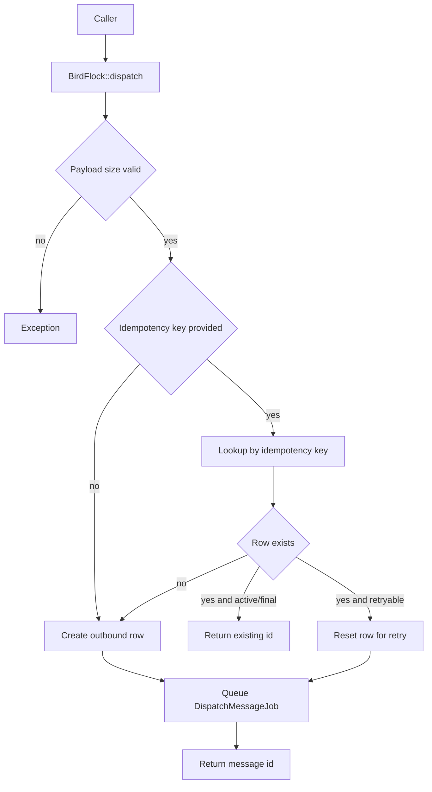
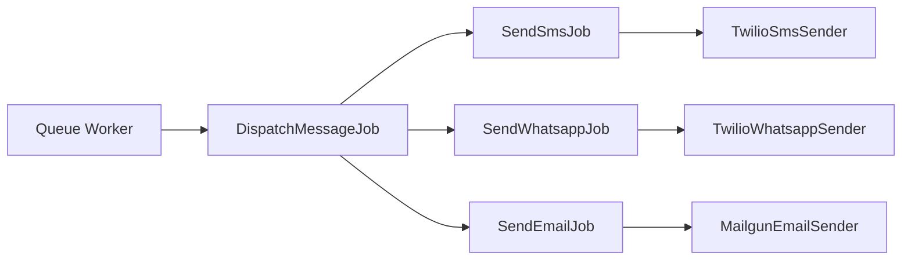
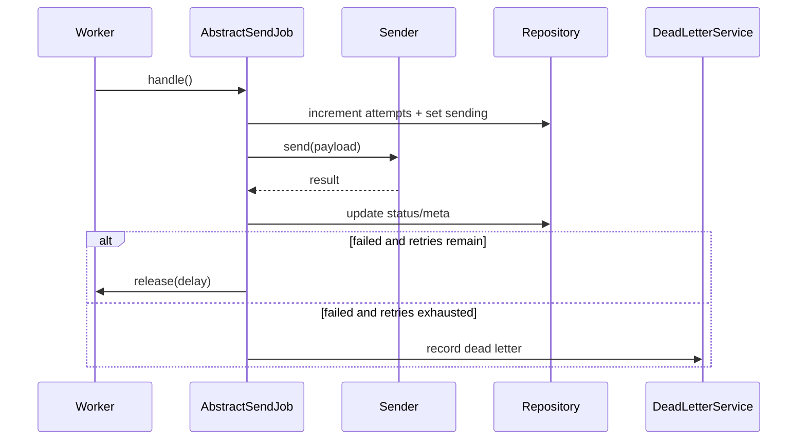

# Business Logic & Core Processes

## Core Business Objective

Provide reliable outbound messaging across `sms`, `whatsapp`, and `email` channels with idempotent dispatch, retry safety, and operational visibility.

## Main Classes Involved

- `Equidna\BirdFlock\BirdFlock` (`src/BirdFlock.php`)
- `Equidna\BirdFlock\DTO\FlightPlan` (`src/DTO/FlightPlan.php`)
- `Equidna\BirdFlock\Jobs\DispatchMessageJob` and channel jobs (`src/Jobs/*`)
- `Equidna\BirdFlock\MessageFactory` (`src/MessageFactory.php`)
- `Equidna\BirdFlock\Repositories\EloquentOutboundMessageRepository` (`src/Repositories/EloquentOutboundMessageRepository.php`)
- `Equidna\BirdFlock\Support\DeadLetterService` (`src/Support/DeadLetterService.php`)
- Webhook controllers under `src/Http/Controllers`

## Process 1: Dispatch + Idempotency

Purpose:

- Accept outbound intent and enqueue message safely.

Rules:

- Reject oversized payloads.
- Reuse existing message for duplicate idempotency keys in active/finalized states.
- Reset and requeue retryable records when applicable.

```mermaid
flowchart TD
  A[Caller] --> B[BirdFlock::dispatch]
  B --> C{Payload size valid}
  C -- no --> X[Exception]
  C -- yes --> D{Idempotency key provided}
  D -- no --> E[Create outbound row]
  D -- yes --> F[Lookup by idempotency key]
  F --> G{Row exists}
  G -- no --> E
  G -- yes and active/final --> H[Return existing id]
  G -- yes and retryable --> I[Reset row for retry]
  E --> J[Queue DispatchMessageJob]
  I --> J
  J --> K[Return message id]
```

## Process 2: Channel Send Execution

Purpose:

- Route message to channel-specific execution and provider sender.

Current factory routing:

- `sms` -> Twilio SMS sender.
- `whatsapp` -> Twilio WhatsApp sender.
- `email` -> Mailgun sender.

```mermaid
flowchart LR
  W[Queue Worker] --> DJ[DispatchMessageJob]
  DJ --> SJ[SendSmsJob]
  DJ --> WJ[SendWhatsappJob]
  DJ --> EJ[SendEmailJob]
  SJ --> TS[TwilioSmsSender]
  WJ --> TW[TwilioWhatsappSender]
  EJ --> MG[MailgunEmailSender]
```

## Process 3: Retry + DLQ

Purpose:

- Protect delivery reliability while containing repeated failures.

Rules:

- Increment attempts on send execution.
- On failed provider result: backoff/release until `tries` exhausted.
- On exhaustion or unhandled exception: record dead-letter entry.

```mermaid
sequenceDiagram
  participant W as Worker
  participant J as AbstractSendJob
  participant S as Sender
  participant R as Repository
  participant D as DeadLetterService

  W->>J: handle()
  J->>R: increment attempts + set sending
  J->>S: send(payload)
  S-->>J: result
  J->>R: update status/meta
  alt failed and retries remain
    J->>W: release(delay)
  else failed and retries exhausted
    J->>D: record dead letter
  end
```

## Process 4: Webhook Reconciliation

Purpose:

- Convert provider callbacks to internal status updates.

Flow:

- Validate webhook signature.
- Parse provider identifiers/status.
- Map provider status to internal status.
- Update outbound message row.
- Emit `WebhookReceived` event.

## Critical Business Constraints

- Valid channels only: `sms|whatsapp|email`.
- Email recipient validation enforced for email channel.
- Phone recipient format sanity checks enforced for phone channels.
- Idempotency key max length: 128.
- Outbound message primary id is ULID (26 chars).

## Open Items

- Multi-provider routing policy is not explicit in current factory implementation.
- Long-term idempotency retention and cleanup policy should be documented by maintainers.
